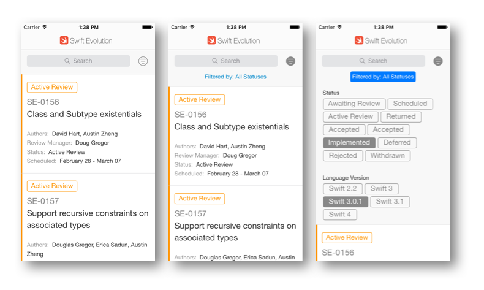

# Swift Evolution - iOS

The main goal of this project is to recreate as an iOS app, the web page created to [Swift Evolution](https://apple.github.io/swift-evolution).
At this moment, we do not have any layout so then, use the screenshots from webpage we will.

## Author

- Thiago Holanda, [thiago@holanda.mobi](mailto:thiago@holanda.mobi)
- Bruno Bilescky, [bruno@compose.tools](mailto:bruno@compose.tools)

## License

Compose is available under the MIT license. See the LICENSE file for more info. 