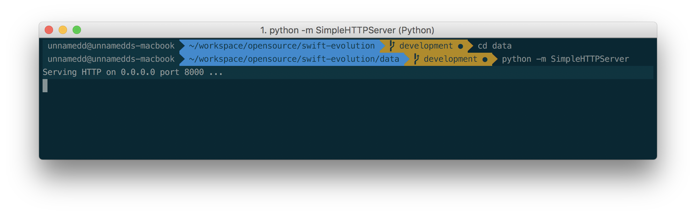
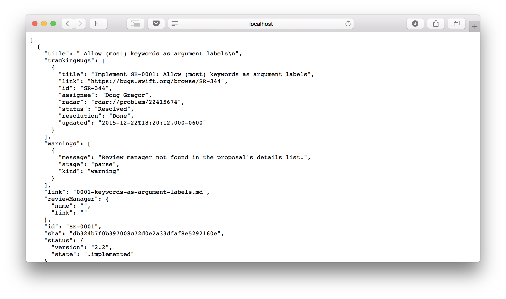
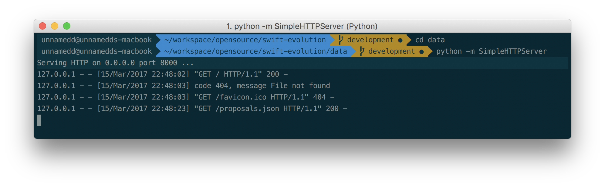

# Swift Evolution - Local Data Server

Sometimes, when you do not have access to internet, but need to do something, you can use all these mocked data and rise up a python server.

All you need to have is a python installed on your macOS (which brings it installed).

## Follow the steps below:

- Open your Terminal
- Navigation into your **_Swift Evolution_** folder

then, you can check if it is working well. On your browser type:

`http://localhost:8000/proposals.json`

If everything is ok, on browser you should see this:

Use the address of this local server on URL to request proposals in this link:

[https://github.com/unnamedd/swift-evolution/blob/development/swift-evolution/sourcecode/services/Service.swift#L7](https://github.com/unnamedd/swift-evolution/blob/development/swift-evolution/sourcecode/services/Service.swift#L7)

## Contact
If you have any question, get in touch with us.

Or tweet me: [@tholanda](https://twitter.com/tholanda)